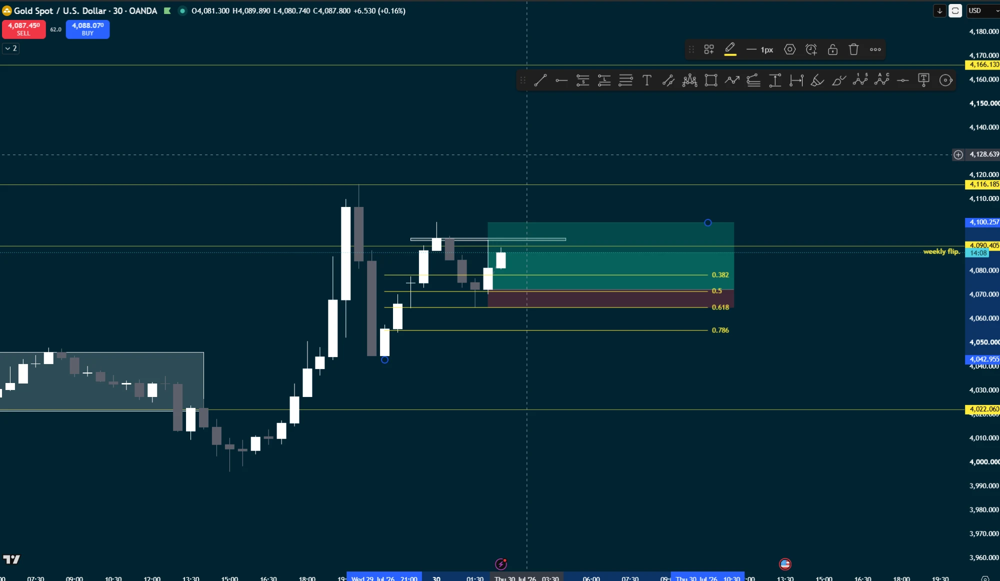
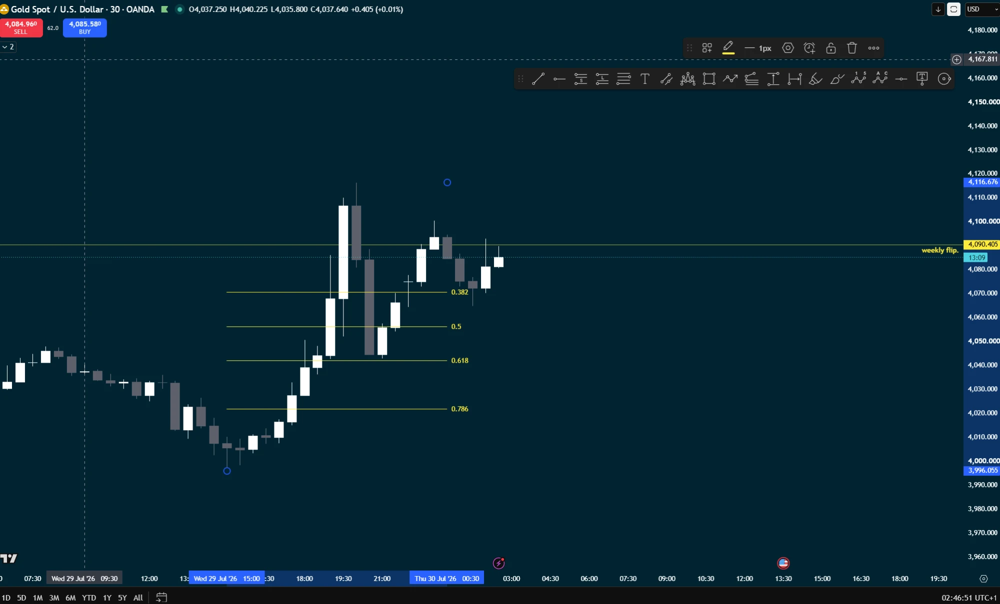

# Setups

Named patterns with a reference chart each, so "the usual setup" means the same
thing every time it's written in a trade log.

---

## A — Uptrend retracement, morning star reversal

**The one I'm actually looking for.**

*Gold spot, 30m, 30 Jul 2026 — not taken, reference example.*

### Criteria, in order

1. **Established uptrend** on the 30m. On the reference chart: consolidation
   4,022–4,046 through the 28th–29th, then a break and a run up to 4,116.
2. **Retracement** into that uptrend.
3. **Retracement reaches the 0.618 Fibonacci** of the impulse leg. The 0.5–0.618
   zone is where it should be turning.
4. **Bullish hammer or pin bar off the 0.618.** Long lower wick, close back up
   in the upper part of the range.
5. **Morning star completing** — the third candle confirming.

Entry is on the confirmation, not on the hammer itself.

*Same setup with the Fibonacci drawn — 0.382 / 0.5 / 0.618 / 0.786 marked, pin
bar off the 0.618, and the weekly flip level at 4,090.405.*

### The trade on the reference chart

| | Level | Distance |
|---|---|---|
| Entry | ~4,072 *(the 0.5)* | |
| Stop | ~4,064 *(under the 0.618)* | ~8 points / 80 ticks |
| Target | 4,100.257 | ~28 points / 282 ticks |

**≈ 3.5:1.** On MGC at the $100 daily budget: 80 ticks → **1 contract, $80 risk**.

### Stop and target logic

- **Stop** goes below the **0.618** and below the pin bar wick — the level that
  says the retracement wasn't finished.
- **Target** is the prior structure above, not a fixed multiple.

### The 0.618 — and which leg it comes off

**Gold respects the 0.618.** That's the level the retracement is expected to
turn at.

*Same chart, fib re-anchored to the larger leg: **3,996.055 → 4,116.676**.*

Two anchorings give two different 0.618s:

| Leg | 0.382 | 0.5 | 0.618 | 0.786 |
|---|---|---|---|---|
| Smaller (~4,041 → ~4,104) | 4,080 | 4,072 | **4,064** | 4,057 |
| Larger (3,996.055 → 4,116.676) | 4,070.6 | 4,056.4 | **4,042.1** | 4,021.9 |

**The confluence on the larger leg is the notable one:**

| Fib | Sits on |
|---|---|
| 0.618 = **4,042.1** | consolidation top, marked at **4,042.955** |
| 0.786 = **4,021.9** | consolidation base, marked at **4,022.060** |

Both fib levels land on structure that was already drawn independently.

> **Open question — which leg gets the fib?** The two anchorings put the 0.618
> 22 points apart, which is the difference between an 80-tick stop and a
> 300-tick one. Needs a rule: most recent impulse, largest impulse, or the leg
> that broke structure.

### Levels marked on the chart

| Level | What it is |
|---|---|
| 4,166.130 | upper structure |
| 4,116.185 | swing high area |
| **4,090.405** | **weekly flip** |
| 4,042.955 | consolidation top |
| 4,022.060 | consolidation base |

### What distinguishes this from trade 0002

0002 was also called a morning star reversal, but there was no uptrend to
retrace into — it was a reversal attempt after a straight drop, catching the
bottom. Setup A requires criterion 1 first: **the trend has to already be up,
and price has to be pulling back into it.**

That's the difference between the two, recorded so the next log entry can say
which one it actually was.

---

*Setups get added here as they're described. Each one needs criteria and a
reference chart before it counts as defined.*
