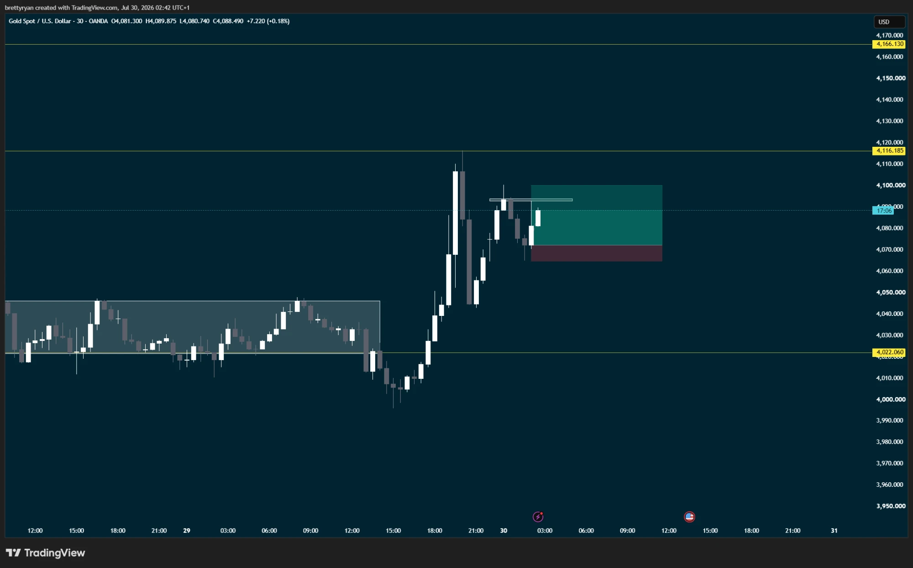

# Setups

Named patterns with a reference chart each, so "the usual setup" means the same
thing every time it's written in a trade log.

---

## A — Uptrend retracement, morning star reversal

**The one I'm actually looking for.**

*Gold spot, 30m, 30 Jul 2026 — not taken, reference example.*

### Criteria, in order

1. **Established uptrend** on the 30m. On the reference chart: consolidation
   4,022–4,046 through the 28th–29th, then a break and a run up to 4,116.
2. **Retracement** into that uptrend — here back to ~4,070.
3. **Bullish hammer or pin bar** at the retracement low. Long lower wick,
   close back up in the upper part of the range.
4. **Morning star completing** — the third candle confirming the reversal.

Entry is on the confirmation, not on the hammer itself.

### The trade on the reference chart

| | Level | Distance |
|---|---|---|
| Entry | ~4,072 | |
| Stop | ~4,065 | ~7 points |
| Target | ~4,100 | ~28 points |

**≈ 4:1** — comfortably past the 2:1 minimum.

### Stop and target logic

- **Stop** goes below the hammer / pin bar wick — the level that says the
  retracement wasn't finished.
- **Target** is the prior structure above, not a fixed multiple.

### What distinguishes this from trade 0002

0002 was also called a morning star reversal, but there was no uptrend to
retrace into — it was a reversal attempt after a straight drop, catching the
bottom. Setup A requires criterion 1 first: **the trend has to already be up,
and price has to be pulling back into it.**

That's the difference between the two, recorded so the next log entry can say
which one it actually was.

---

*Setups get added here as they're described. Each one needs criteria and a
reference chart before it counts as defined.*
