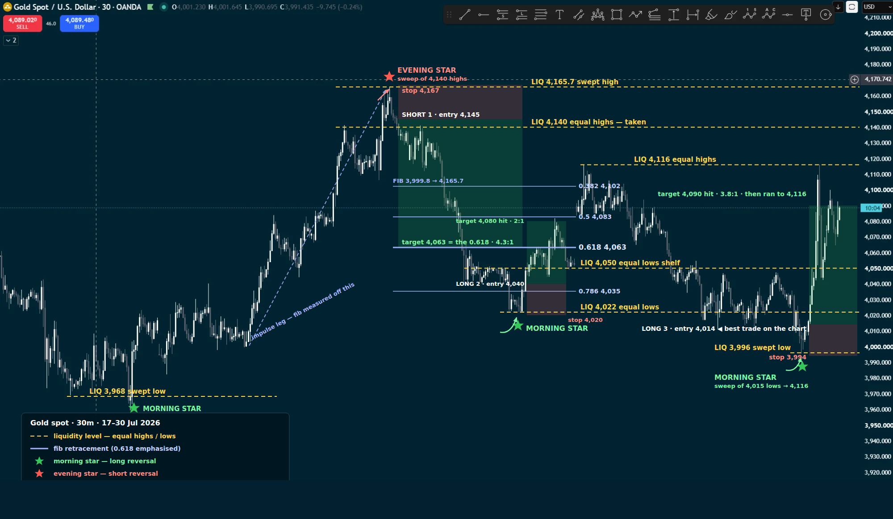

# Reference — liquidity + fib review, Gold 30m, 17-30 Jul 2026

Drawn on the chart sent in, not typed out. Four reversals marked, three tradeable.

## Trade 1 — SHORT, the 4,165.7 sweep

Liquidity: equal highs at 4,140 taken, wick to 4,165.7, evening star into the
rejection.

| Entry | Stop | Target | R:R |
|---|---|---|---|
| 4,145 | 4,167 | 4,063 (0.618 of the 3,999.8 → 4,165.7 leg) | **4.3:1** |

## Trade 2 — LONG, the 4,022 sweep

Liquidity: equal lows at 4,022 taken, morning star, into the 4,050 shelf.

| Entry | Stop | Target | R:R |
|---|---|---|---|
| 4,040 | 4,020 | 4,080 (hit) | **2:1** |

## Trade 3 — LONG, the 3,995.8 sweep — best on the chart

Liquidity: equal lows at 3,996 taken, morning star, ran clean to the 4,116
liquidity above and beyond.

| Entry | Stop | Target | R:R |
|---|---|---|---|
| 4,014 | 3,994 | 4,090 (hit, then ran to 4,116) | **3.8:1**, more if held |

## Not tradeable

Morning star at the 3,968 low on the far left of the chart — no defined range
before it to size a stop against.

## Liquidity levels marked

4,165.7 (swept) · 4,140 (equal highs, taken) · 4,116 (equal highs) · 4,050
(equal lows shelf) · 4,022 (equal lows) · 3,996 (swept) · 3,968 (swept)
